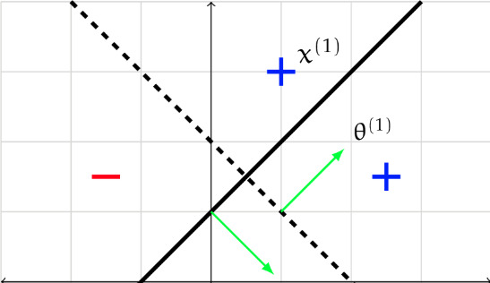

# MIT-Open-Learning-6.036-Introduction-To-Machine-Learning-Spring-2019

My coursework for MIT Open Learning 6.036 Introduction To Machine Learning Spring 2019 class.

All solutions are my own.

This is the only course among my repositories taken through MIT Open Learning rather than MIT OCW. All python code and quizzes were completed on the website. The files here are the handwritten lab discussions that were required as part of the coursework.

Taught by [Prof. Leslie Kaelbling](https://ocw.mit.edu/search/?q=Prof.+Leslie+Kaelbling).

Course Link: https://openlearninglibrary.mit.edu/courses/course-v1:MITx+6.036+1T2019/

## Topics Covered

| Topic | Subtopics |
|-------|-----------|
| Linear Classifiers | Perceptrons, feature representation |
| Optimization | Margin maximization, logistic regression, gradient descent |
| Regression | Linear regression |
| Neural Networks | Feedforward networks, training, convolutional neural networks |
| Sequential Models | State machines, Markov decision processes, reinforcement learning, recurrent neural networks |
| Applied ML | Recommender systems, decision trees, nearest neighbors |

## Coursework Done

| Type | Count |
|------|-------|
| Labs | 7 |

## My Other MIT Coursework

[18.01SC Single Variable Calculus](https://github.com/BenyaminJazayeri/MIT-OCW-18.01SC-Single-Variable-Calculus-Fall-2010) · [18.02SC Multivariable Calculus](https://github.com/BenyaminJazayeri/MIT-OCW-18.02SC-Multivariable-Calculus-Fall-2010) · [18.06SC Linear Algebra](https://github.com/BenyaminJazayeri/MIT-OCW-18.06SC-Linear-Algebra-Fall-2011) · [6.0001 Intro to CS & Programming in Python](https://github.com/BenyaminJazayeri/MIT-OCW-6.0001-Introduction-To-Computer-Science-And-Programming-In-Python-Fall-2016) · [6.0002 Intro to Computational Thinking & Data Science](https://github.com/BenyaminJazayeri/MIT-OCW-6.0002-Introduction-To-Computational-Thinking-And-Data-Science-Fall-2016) · [6.006 Introduction to Algorithms](https://github.com/BenyaminJazayeri/MIT-OCW-6.006-Introduction-To-Algorithms-Fall-2011) · [6.034 Artificial Intelligence](https://github.com/BenyaminJazayeri/MIT-OCW-6.034-Artificial-Intelligence-Fall-2010) · [6.042J Mathematics for Computer Science](https://github.com/BenyaminJazayeri/MIT-OCW-6.042J-Mathematics-For-Computer-Science-Fall-2010)

I'd be very happy to discuss anything related to MIT OCW. Reach me at [benjamin.jazayeri@gmail.com](mailto:benjamin.jazayeri@gmail.com).
